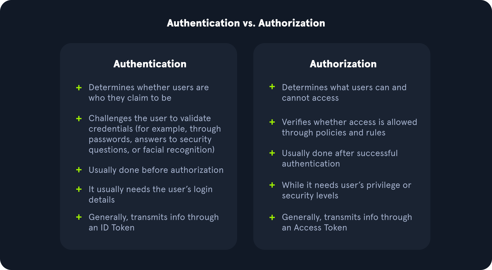

# Broken Access Control

**What is Authentication**

Authentication is defined as "The process of verifying a claim that a system entity or system resource has a certain attribute value" in RFC 4949. In information security, authentication is the process of confirming an entity's identity, ensuring they are who they claim to be. On the other hand, authorization is an "approval that is granted to a system entity to access a system resource"; while this module will not cover authorization deeply, understanding the major difference between it and authentication is vital to approach this module with the appropriate mindset.

**Common Authentication Methods**

Information technology systems can implement different authentication methods. Typically, they can be divided into the following three major categories:
- Knowledge-based authentication
- Ownership-based authentication
- Inherence-based authentication

**What is Authentication**

Authorization is used by the application to verify whether a given user has permission to access a given resource.



## IDOR

Insecure Direct Object References (IDOR) vulnerabilities are among the most common web vulnerabilities and can significantly impact the vulnerable web application. IDOR vulnerabilities occur when a web application exposes a direct reference to an object, like a file or a database resource, which the end-user can directly control to obtain access to other similar objects.
For example, if users request access to a file they recently uploaded, they may get a link to it such as (download.php?file_id=123

````
/documents.php?uid=1

Change the uid to other values and see if can access the information of that user
````

**Bypassing Encoded References**

````
$ echo -n 1 | md5sum

$ for i in {1..10}; do echo -n $i | base64 -w 0 | md5sum | tr -d ' -'; done
````
````
#!/bin/bash

for i in {1..10}; do
    for hash in $(echo -n $i | base64 -w 0 | md5sum | tr -d ' -'); do
        curl -sOJ -X POST -d "contract=$hash" http://SERVER_IP:PORT/download.php
    done
done
````

Basically, this vulnerability consists of swapping IDs with other users and seeing if we can access their information or role to gain administrative privileges.
We can use HTTP methods to make changes to other users' IDs or even to delete information.
- PUT
- Patch
- Delete

## Reset Tokens & MFA Codes

**Guessable Password Reset Questions**

While these questions seem tied to the individual user, they can often be obtained through OSINT or guessed, given a sufficient number of attempts, i.e., a lack of brute-force protection.

**Attacking Weak Reset Tokens & MFA Codes**
````
$ seq -w 0 9999 > tokens.txt
$ ffuf -w ./tokens.txt -u http://<domain>/reset_password.php?token=FUZZ -fr "The provided token is invalid"
````

## Authentication Bypasses

**Direct Access**

The most straightforward way of bypassing authentication checks is to request the protected resource directly from an unauthenticated context. An unauthenticated attacker can access protected information if the web application does not properly verify that the request is authenticated.

This vulnerability consists of trying to access an endpoint directly, intercepting the response, and checking if the redirect body contains the page's HTML. If it does, simply change the status code to 200.
- Access the confidential endpoint
- Intercept the response
- Change the status code from 301/302 to 200 OK

**Parameter Modification**

Check if the application displays any parameters or perform parameter and ID fuzzing to verify if any of them already allow us to access the confidential endpoint.


## Session Tokens

**Brute-Force Attack**

Attempt to discover valid session tokens through brute force. This is done after analyzing and verifying which components are common and which are different.

**Predictable Session Tokens**

Analyze how predictable tokens are, whether it is by timestamp, user data in base64, etc.


## HTTP Verb Tampering

**Bypassing Basic Authentication**

This method consists of changing the request methods to see if we get different responses. In other words, the application may often check whether the user is authenticated in the GET method but not in the POST method. This means that if we change the request method, we may be able to gain access.
- GET
- POST
- PUT
- PATCH
- HEAD

**Bypassing Security Filters**

This method consists once again of changing the HTTP methods of the request.
Sometimes applications apply filters to the parameters they receive via GET and do not perform this check via POST. In other words, what we can do in this scenario is identify the parameters being sent to the server and change the method.
If the application is sending via the GET method in the URL, we can switch to POST and send it in the request body, and vice versa.
